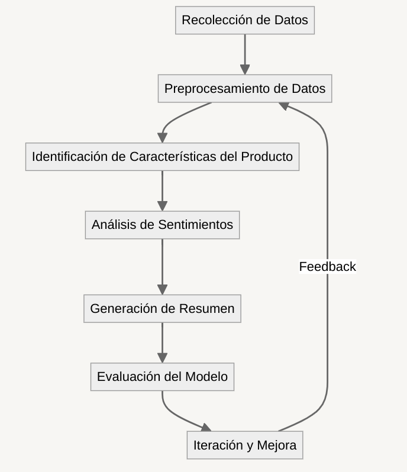

# Resumen Automático de Opiniones Sobre un Producto

Integrantes:

- Ignacio Scavuzzo
- Juan Bratti

Repositorio: https://github.com/juanbratti/tm24_pln_proyecto

# Resumen

El objetivo del proyecto es desarrollar un modelo de procesamiento de lenguaje natural capaz de generar resúmenes detallados a partir de reseñas de compradores sobre productos. 

El propósito es que se identifique, basándose en un conjunto de reseñas de un producto, las características mencionadas sobre el mismo y así elabore una síntesis de las opiniones más destacadas de los consumidores respecto a cada una de ellas. 

Para su desarrollo, utilizaremos un pipeline que abarca: la recolección y limpieza de datos pertinentes, el preprocesamiento de texto, la identificación de características del producto mediante técnicas de modelado de tópicos, el análisis de sentimientos de las reseñas, y la generación de resúmenes utilizando grandes modelos de lenguaje. 

Además, será parte fundamental del proyecto evaluar el modelo y analizar su desempeño con distintas métricas para asegurar la precisión y efectividad de los resúmenes generados.

# Hipótesis

**Hipótesis General:**

Como hipótesis general planteamos que la utilización de un modelo de procesamiento de lenguaje natural podrá con precision generar un resumen que agrupe las características valoradas por otros consumidores. 

**Hipótesis Específicas:**

Por otro lado, planteamos algunas sub-hipótesis mas especificas que queremos desarrollar:

1. Una mayor cantidad de reseñas sobre un producto implicará un mejor resumen.
2. Existe un número optimo de cantidad de palabras que se toman a la hora de tokenizar y ofrece mejores resultados que otras cantidades.
3. Información sobre el producto (su titulo y especificaciones) ayuda significativamente al modelo a realizar categorización y análisis. 
4. Las stopwords influyen negativamente en el desempeño del modelo.

De estas hipótesis, se deducen experimentos básicos pero que aportan información suficiente para realizar conclusiones.

1. Probar el modelo para distintas cantidad de reseñas. Tomar ciertos intervalos y ver la relación entre cantidad de reseñas y la precision del resumen.
2. Nuevamente, probar para distintas cantidades de palabras por token.

# Objetivos Preliminares

1. Procesar los datasets y obtener un archivo con productos y sus reseñas.
2. Realizar la etapa de preprocesamiento para limpiar, tokenizar los datos.
3. Identificar tópicos de una review usando LDA.
4. Hacer *sentiment analysis* de una review y para cada tópico presente identificar su positividad/negatividad
5. Generar un resumen usando un LLM.
6. Evaluar el modelo usando métricas.
7. Iterar y mejorar

# Planificación

### 1. **Recolección de Datos**

Usamos los datos https://cseweb.ucsd.edu/~jmcauley/datasets/amazon/links.html  provenientes de Amazon. Debemos limpiar esos datos y ajustarlo a nuestras necesidades.

- **Formato de datos**: Tenemos que ver que los atributos sean relevantes a lo que queremos hacer. Vamos a requerir de un campo que contenga las reseñas y otro que contenga el id del producto a la que hacen referencia.

Usaremos *scripting* y la librería `Pandas`.

### 2. **Preprocesamiento de Datos**

- **Limpieza de texto**: Identificar caracteres especiales y emojis. En el primer caso eliminarlos, y en el segundo, traducirlos a texto.
    
    Para traducir los emojis usaremos la librería `emoji-translate`.
    
- **Eliminación de stopwords, sustantivos o palabras no relevantes, lematización**: eliminar stopwords y realizar una lematización de las palabras. Usaremos `SpaCy`
- **Tokenización**: dividir cada review en secuencias de $n$-palabras.
    
    Para esto usaremos la librería `SpaCy`.
    
- **Vectorización** para convertir cada secuencia de $n$-palabras en una matriz de términos usando `CountVectorizer`.

### 3. **Identificación de Características del Producto**

Como dijimos en el preprocesamiento, para un producto, realizaremos la tokenización en secuencias de $n$-palabras de sus reviews. Luego, lo que haremos será encontrar en las secuencias, las características sobre el producto de las que se opina. Para esto aplicamos:

- **Modelado de Tópicos**: Entrenaremos un modelo de LDA (Latent Dirichlet Allocation) para agrupar los conjuntos de $n$-palabras según características identificadas en las mismas.
    
    LDA nos brindará un modelo que nos devolverá Tópicos (en forma de listas de características) en donde cada tópico menciona diversas características presentes (todas relacionadas entre ellas). Nosotros usaremos este modelo en cada secuencia, y veremos qué tópico se le asigna.
    

Guardaremos esta información en un DataFrame con la siguiente estructura:

| Sequence | Topic Assigned |
| --- | --- |
| 0 | Topic 1 |
| 1 | Topic 2 |
| … | … |

### 4. **Análisis de Sentimientos**

Además de la detección de los tópicos, vamos a querer asignarle a cada secuencia un sentimiento asociado. Este sentimiento puede tener tres grados: negativo, neutro o positivo.

Para realizar esto, usaremos la librería `TextBlob`, que usando sus funciones, procesaremos las secuencias de $n$-palabras y obtendremos un rango de sentimiento entre $-1$ (muy negativo y $1$ (muy positivo) llamado **compound**, el cual mapearemos a las categorías “negativo”, “neutro”, “positivo”.

Luego de procesar cada secuencia de $n$-palabras, agregaremos al DataFrame definido anteriormente, la categoría correspondiente al grado de sentimiento identificado. El DataFrame tendrá la siguiente forma:

| Sequence | Topic Assigned | Sentiment Assigned |
| --- | --- | --- |
| 0 | Topic 1 | Neutral |
| 1 | Topic 2 | Positive |
| … | … | … |

### 5. **Generación de Resumen**

Para la generación del resumen, usaremos un modelo grande de lenguaje ($LLMs$). 

Lo que haremos será extraer del DataFrame donde tenemos para cada secuencia su tópico y su sentimiento, los $k$ tópicos más frecuentes junto con su sentimiento.

Luego, usando un modelo grande de lenguaje, generaremos un breve texto utilizando como prompt: “Generar un resumen ordenado basado en los siguientes tópicos y sus correspondientes sentimientos: (…). Ejemplo: La característica *X* tiene una buena relación calidad-precio…”.

En este paso, usaremos modelos abiertos de Hugging Face.

### 6. **Evaluación del Modelo**

1. Calidad del texto generado: usaremos la librería `language-text` para corregir errores gramaticales.
2. Evaluación de coherencia de los tópicos generados por LDA: revisión humana. 
3. Precisión del resumen generado: revisión humana o analizar la similitud semántica con un resumen de referencia.
4. Uso de métricas como ROUGE, BLEU, WER (Word Error Rate) y Valor-F para evaluación de los LLM

### 7. **Iteración y Mejora**

- Refinamiento del preprocesamiento de datos, podemos probar con diferentes formas de vectorizar o un número distinto de palabras en los tokens. Analizar la incidencia de stopwords y de la lematización.
- Probar diferentes formas de hacer análisis de sentimiento y generación del resumen final.
- Probar otras formas de modelar los tópicos.

## Cronograma

| Semana | Planificación |
| --- | --- |
| 16/09 - 23/09 | Recopilación y procesamiento del dataset. |
| 23/09 - 02/10 | Probar y evaluar modelado de tópicos usando LDA. |
| 02/10 - 09/10 | Realizar análisis del sentimiento a las secuencias. |
| 09/10 - 16/10 | Generación de resumen usando LLM. |
| 16/10 - 21/10 | Evaluación de los modelos. |
| 21/10 - Fin de cursada | Iteración y mejora. |

### Diagrama del Proyecto

# Referencia

https://www.linkedin.com/pulse/benchmarks-evaluating-llms-anshuman-roy/

https://medium.com/@pinakdatta/understanding-lda-unveiling-hidden-topics-in-text-data-9bbbd25ae162